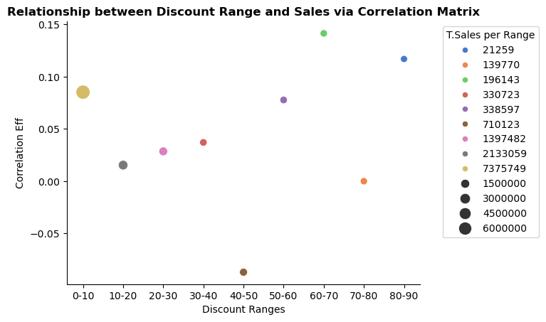

# Introduction
The dataset I used is the Superstore data I obtained from Kaggle that was published by [Laiba Anwer](https://www.kaggle.com/datasets/aditisaxena20/superstore-sales-dataset) over two years ago. It is robust and has over 51,000 rows and 21 columns
# Background
I wanted to investigate and identify the factors that contribute to the performance of a superstore, the key metrics to look out for, and the areas where the store can focus on related to marketing and logistics strategies.

# Tools I used

The tools I used to generate my insights for the project include the following:
- **Python**
- **Visual Studio Code**: My ideal code editor for Python and SQL.
- **Git and GitHub:** Needed a version control to showcase the steps and changes  made as I progressed with my analysis. It's also ideal for sharing and collaboration purposes.

# The Analysis
## 1.  What is the estimated lifetime value of customers in different segments?

Wanted to figure out the most valuable markets and customer segments for long-term growth by analyzing the lifetime value of each customer segment in every market.

View my notebook showcasing the steps I took:
[CLV_per_Segment](1_CLV_per_segment.ipynb)

## This is the code snippet I used to create my visualization:

```python
l_markets=len(df['market'].unique())

nrows = 4
ncols = 2

fig,ax=plt.subplots(nrows,ncols,figsize=(12,15))
ax = ax.flatten()

df_clv_sum=df_clv.groupby('Market')['CLV'].sum().to_frame(name='Sum').reset_index()
df_clv_merged=df_clv.merge(df_clv_sum,how='inner',on='Market')

market_list=df['market'].unique().tolist()

for i,market in enumerate(market_list):
    df_market=df_clv_merged[df_clv_merged['Market']==market]
    sns.barplot(data=df_market,x='Segment',y='CLV',hue='Segment',ax=ax[i],palette='viridis')
    sns.despine()
    ax[i].set_title(f'Customer Lifetime Value in {market}',fontsize=15,fontweight='bold')
    ax[i].set_ylabel('CLV($)')
    ax[i].set_xlabel('Segment')
    total_clv = df_clv_sum[df_clv_sum['Market'] == market]['Sum'].values[0]
    handles, labels = ax[i].get_legend_handles_labels()#remove message warnings on legends.
    if handles:
        ax[i].legend(title=f'Total CLV=${total_clv:,.2f}', bbox_to_anchor=(1,1), loc='best')

for j in range(len(market_list), len(ax)):# Hide unused subplots.
    ax[j].axis('off')
    
plt.subplots_adjust(hspace=0.7,wspace=0.3)    
fig.tight_layout()

plt.show()
```

### Result

*Bar graph visualizing the Customer lifetime value for each segment in each market.*

*Bar graph visualizing the Customer lifetime value for each segment in each market.*
### Insights
- The APAC market, with a customer lifetime value (CLV) exceeding $5 million, demonstrated its significant contribution to the company's bottom line.
- The store should prioritize increasing revenue in Canada, EMEA, and Africa.

## 2.  Which product categories are driving the most revenue and how do sale figures compare across various product categories?
The company has three primary customer segments. To assess their performance, I aimed to analyze each segment's contribution to total sales and identify any positive growth trends.

View my notebook showcasing the steps I took:
[MarketSales_by_Segments.](2_MarketSalesSegments.ipynb)

## This is the code snippet I used to create my visualization:
```python
fig,ax =plt.subplots(l_markets,1,figsize=(8, 4 *l_markets),sharex=False)

sns.despine()
sns.set_theme(style='ticks')
h_order= ['Home Office','Corporate','Consumer']

for i,market in enumerate(markets):
    df_market = df[df['market']==market]
    df_market_grp =df_market.groupby(['segment','year'])['sales'].sum().to_frame()
    sns.barplot(data=df_market_grp,x='year',y='sales',ax=ax[i],hue='segment',hue_order=h_order,palette='viridis')
    ax[i].set_title(f'Customer Segment sales for {market}',fontsize=15,fontweight='bold')
    ax[i].set_ylabel('Sum of Sales for each Segment($)')
    ax[i].set_xlabel('Years of Corresponding Sales')
    ax[i].legend(title='Segment', bbox_to_anchor=(0, 1.05), loc='upper left')
    plt.subplots_adjust(hspace=0.7)
    
fig.tight_layout()
plt.show()
```
### Result


*Bar graph visualizing of the Customer segment sales for each market.*

### Insights
- The graphs illustrate a consistent positive sales growth trend for all markets from 2011 to 2014, with the consumer segment being the primary driver of this growth in each year.

## 3.  How effective are different discount levels in driving sales and is there a noticeable pattern in sales increase relative to the discount amount?
Given the store's frequent discounts, I sought to determine which discount levels are most effective in driving sales and whether any discernible patterns or trends exist.

View my notebook showcasing the steps I took:
[3_DiscountEffectiveness](3_DiscountEffectiveness.ipynb)

## This is the code snippet I used to create my visualization:
```python
bins = [0, 10, 20, 30, 40, 50, 60, 70, 80, 90]
labels = ['0-10', '10-20', '20-30', '30-40', '40-50', '50-60', '60-70', '70-80', '80-90']
df['discount(%)']= df['discount']*100
df['discount_bin'] = pd.cut(df['discount(%)'], bins=bins, labels=labels, right=False)
df=df.drop(labels='discount(%)',axis=1)
df
plt.figure(figsize=(10, 6))
ax=sns.boxplot(y='discount_bin', x='sales', hue='discount_bin',data=df,palette='viridis')
xticks = range(0, int(df['sales'].max()) + 2000, 2000)
ax.set_xticks(xticks)
ax.set_xticklabels([f'{i:,}' for i in xticks])
plt.title('Sales Distribution by Discount Range')
plt.ylabel('Discount_Range')
plt.xlabel('Sales')
plt.show()
```
### Result


*Boxplot visualizing the Sales Distribution across different Discount levels.*

*Scatterplot visualizing the different Pearson correlation coefficients for different discount levels.*

### Insights
- The boxplot reveals significant sales variability across different discount levels. The 0-10% discount group has the most outliers, with sales reaching $18,000 for some customers. However, the frequency of outliers decreases with higher discount levels.
- A Pearson correlation matrix was used to assess any direct linear relationship between discount levels and sales. The analysis generally indicated a weak, if any, positive or negative correlation, as most coefficients were far from 0 or 1. 
- Notably, the only negative coefficient was observed for the 40-50% discount. This suggests that the store should delve deeper into the performance of this discount level to identify potential contributing factors to the negative correlation or consider discontinuing it altogether.

## 4.  What is the Average order value from the top 10 overall buyers and also markets?
Wanted to find out the top 10 highest purchasing customers for the store by indentifying their average order value. I did the same for the markets but I also compared it against the revenue from the product categories in each market.

View my notebook showcasing the steps I took:
[AverageOrderValue](4_AverageOrderValue.ipynb)

## This is the code snippet I used to create my visualization:
```python
sns.barplot(data=customer_AOV,x='customer_name',y='AOV_per_Customer',hue='total_revenue',palette='inferno')
sns.despine()
plt.title('Most Valuable Customers in relation to A.O.V',fontweight='bold')
plt.xlabel('Customers')
plt.ylabel('A.O.V per customer')
plt.legend(loc='best',title='Total Revenue',bbox_to_anchor=(1.05,1))
plt.xticks(rotation=45,ha='right')
plt.show()

```
```python
sns.barplot(data=market_AOV,x='market',y='AOV_per_market',ax=ax[0],hue='total_revenue',palette='inferno')
sns.despine()
ax[0].set_title('Most Valuable Markets in relation to A.O.V',fontweight='bold')
ax[0].set_xlabel('Markets')
ax[0].set_ylabel('A.O.V per market')
ax[0].legend(loc='best',title='Total Revenue',bbox_to_anchor=(1.05,1))
ax[0].set_xticklabels(ax[0].get_xticklabels(),rotation=45,ha='right')

sns.barplot(data=df_category,x='market_',y='sum_sales',ax=ax[1],hue='category_',palette='viridis')
sns.despine()
ax[1].set_title('Revenue per Product Category in each Market',fontweight='bold')
ax[1].set_xlabel('Markets')
ax[1].set_ylabel('Total Revenue per Category')
ax[1].legend(loc='best',title='Product Category',bbox_to_anchor=(1.05,1))
ax[1].set_xticklabels(ax[1].get_xticklabels(),rotation=45,ha='right')

fig.tight_layout()
plt.show()

```
### Result


*Bar graph visualizing of the Average order value of the top 10 store buyers.*

*Bar graph visualizing the comparison of the Average order value of the markets against the revenue of different product categories.*

### Insights
- The first graph showcases the customers the store should target more using marketing strategies such as specialized promotions, increased discount offers on bulk orders or any specialized deals.
- The second showcases just how valuable the APAC market is for the store together with the EU. Furthermore, when comparing agains the revenue generated per product category, it shows just how valuable technology products are. The store could start generating digital marketing strategies to maximize on customers purchasing technology products. Tactics like specialized promotions that fit such markets could prove pivotal in increasing sales in the near future.

## 5.  
### 5.1 How does shipping cost and shipping mode affect Sales ?
A significant portion of the store's business relies on global shipping. To understand the impact of shipping costs and modes on worldwide sales, I aimed to analyze their correlation.

View my notebook showcasing the steps I took:
[Shipping&GrowthRate](5_Shipping&GrowthRate.ipynb)

## This is the code snippet I used to create my visualization:
```python
fig, ax=plt.subplots(1,2,figsize=(10,5))

df_ship_perc=df.pivot_table(values=['sales','shipping_cost'],index=['ship_mode','year'],aggfunc='sum')
df_ship_perc['shipping_cost_percentage']=(df_ship_perc['shipping_cost']/df_ship_perc['sales'])*100
df_ship_perc
sns.barplot(data=df_ship_perc,x='ship_mode',y='shipping_cost_percentage',ax=ax[0],hue='year',palette='viridis')
sns.despine()
ax[0].set_ylabel('Shipping Cost as(%)')
ax[0].set_xlabel('Shipping Mode')
ax[0].legend(loc='best',title='Year',bbox_to_anchor=(1,1))
ax[0].set_title('Shipping cost distribution per Shipping Mode',fontweight='bold')
ax[0].set_xticklabels(ax[0].get_xticklabels(),rotation=45,ha='right')
ax[0].set_ylim(0,20)

df_piv = df.pivot_table(values=['sales','shipping_cost'],index=['ship_mode','year'],aggfunc='sum').sort_values(by='ship_mode')
sns.barplot(data=df_piv,x='ship_mode',y='sales',hue='year',ax=ax[1],palette='viridis')
sns.despine()
ax[1].set_ylabel('Total Sales per Shipping Mode')
ax[1].set_xlabel('Shipping Mode')
ax[1].legend(loc='best',title='Year',bbox_to_anchor=(1,1))
ax[1].set_title('Total Sales distribution per Shipping Mode',fontweight='bold')
ax[1].set_xticklabels(ax[0].get_xticklabels(),rotation=45,ha='right')

plt.tight_layout()
plt.show()
```
### Result of the code

*Two-sided Bar graph visualizing the Shipping mode and costs and how they relate to overall sales.*

### Insights
- Shipping costs for all four modes remained relatively consistent from 2011 to 2014, with first-class shipping being the most expensive and standard shipping the least
- A key finding is that standard shipping, despite being the least expensive, is associated with the highest overall sales, suggesting that many customers are willing to wait for the more affordable option.

### 5.2.  Which markets show promise in relation of order growth rate ? 
Wanted to identify the rate of growth of orders by filtering out the data on a year-by-year basis and identifying which markets showed the highest overall growth of total orders.

View my notebook showcasing the steps I took:
[Shipping&GrowthRate](5_Shipping&GrowthRate.ipynb)

## This is the code snippet I used to create my visualization:
```python
fig, ax=plt.subplots(1,2,figsize=(13,5))

sns.barplot(data=df_piv_mean,x='market',y='mean_count_growth_rate',ax=ax[0],hue='mean_sales',palette='viridis')
sns.despine()
ax[0].set_ylabel('Mean order count growth rate (%)')
ax[0].set_xlabel('Market')
ax[0].legend(loc='best',title='Avg Sale per order',bbox_to_anchor=(0.85,1))
ax[0].set_title('Highest Growth rate by order count per Market',fontweight='bold')
ax[0].set_xticklabels(ax[0].get_xticklabels(),rotation=45,ha='right')

sns.barplot(data=df_piv,x='market',y='count_growth_rate',ax=ax[1],hue='year',palette='viridis')
sns.despine()
ax[1].set_ylabel('order growth rate per year(%)')
ax[1].set_xlabel('Market')
ax[1].legend(loc='best',title='Year',bbox_to_anchor=(1,1))
ax[1].set_title('Growth rate by order count per Market(Year-by-Year)',fontweight='bold')
ax[1].set_xticklabels(ax[0].get_xticklabels(),rotation=45,ha='right')

plt.tight_layout()
plt.show
```
### Result


*Two-sided Bar graph visualizing the growth rate of orders by market.*

### Insights
- A comparative analysis of the two graphs highlights EMEA as the most promising market. It exhibited a consistent order growth rate and achieved the highest overall order growth, closely followed by the EU. This data suggests that focusing marketing initiatives on EMEA could be instrumental in maximizing order growth and generating increased revenue.

## 6.  Which markets generated the most profit per unit and what's the correlation between net profit and major performance metrics ? 

View my notebook showcasing the steps I took:
[NetProfit](6_NetProfit.ipynb)

## This is the code snippet I used to create my visualization:

```python
fig, axs = plt.subplots(1, 3, figsize=(16, 7), sharex=True, sharey=True)

sns.heatmap(pearson_df, annot=True, cmap='coolwarm', vmin=-1, vmax=1, ax=axs[0])
axs[0].set_title('Pearson Correlation',fontweight='bold')

sns.heatmap(spearman_df, annot=True, cmap='coolwarm', vmin=-1, vmax=1, ax=axs[1])
axs[1].set_title('Spearman Correlation',fontweight='bold')

sns.heatmap(kendall_df, annot=True, cmap='coolwarm', vmin=-1, vmax=1, ax=axs[2])
axs[2].set_title('Kendall Correlation',fontweight='bold')

plt.tight_layout()
plt.suptitle('Three Major Correlational Matrices for the 5 major numerical metrics',fontsize=15,fontweight='bold')
plt.subplots_adjust(top=0.9) 
plt.show()
```

```python
df_netp=df.pivot_table(values=['sales','profit','quantity'],index=['market','category'],aggfunc='sum').reset_index()
df_netp['net_profit_perc']=(df_netp['profit']/df_netp['sales'])*100
df_netp['profit_per_unit']=(df_netp['profit']/df_netp['quantity'])*100
df_netp
sns.barplot(data=df_netp,x='market',y='profit',hue='category',palette='inferno')
sns.despine()
plt.title('Profit per Unit for each product category',fontweight='bold')
plt.xlabel('Market')
plt.ylabel('Profit per Unit')
plt.legend(loc='best',title='Product category',bbox_to_anchor=(1.05,1))
plt.xticks(rotation=45,ha='right')
plt.show()
```
### Result

*Bar graph visualizing the profit per unit for all markets.*


*Three-sided Heatmap visualizing the correlation between net profit and other major performance metrics.*

### Insights
- The APAC market demonstrated the highest profit per unit, with the technology product category achieving over $200,000 in profit per unit
- To analyze potential correlations, I examined five metrics: net percentage, sales, profit, quantity, and profit per unit. Employing all three correlation coefficient matrices, I identified two significant relationships: between quantity and sales, and between quantity and profit per unit.
- The first correlation, ranging from 0.533975 to 0.757143, indicated a positive linear relationship. This suggests that as the quantity of products sold increases, so do the store's sales, which is logical.
- The second correlation, ranging from -0.323810 to -0.496104, revealed a negative relationship between quantity and profit per unit. Possible explanations for this include: increased shipping costs associated with bulk orders, purchases of low-profit-margin products in bulk, or higher discounts offered on larger quantities.

# Conclusions
This dataset was very interesting to evaluate. It showed an overall view of how a Superstore performs and the main takeaways I gathered from the data include:

- The store needs to start prioritizing the APAC, EMEA and EU markets as all three markets show promise for potential growth in bth orders and sales.
- The store needs to invest in a more sustainable strategy to maximise on the future customers who prefer to ship their products using the Standard class as a large proportion of sales are attributed to that specific shipping mode.

# What I learned
I was able to improve upon my python skills, analyze data and gain curcial insights into how superstore operates and the main metrics to look out for.